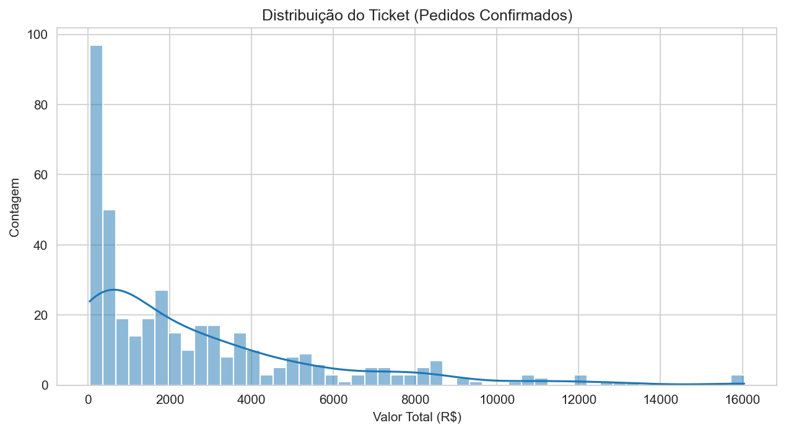
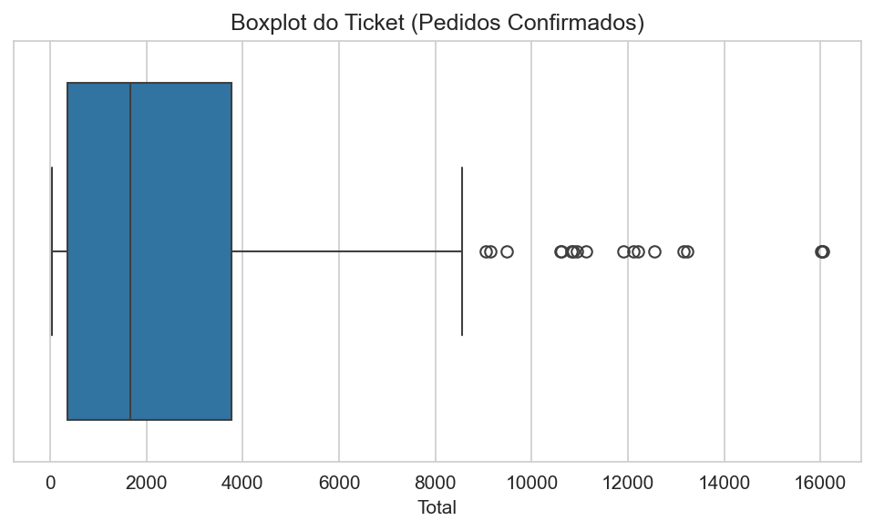
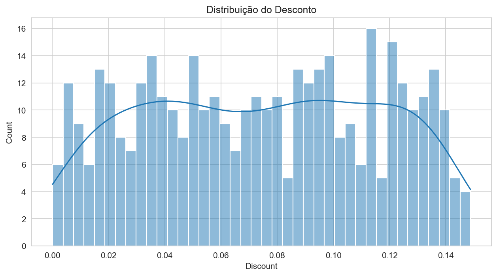
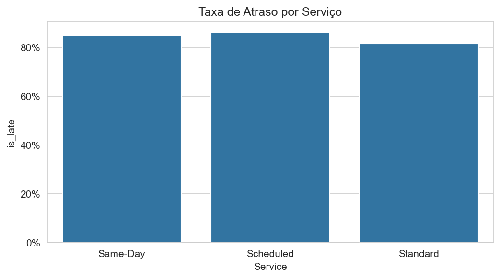
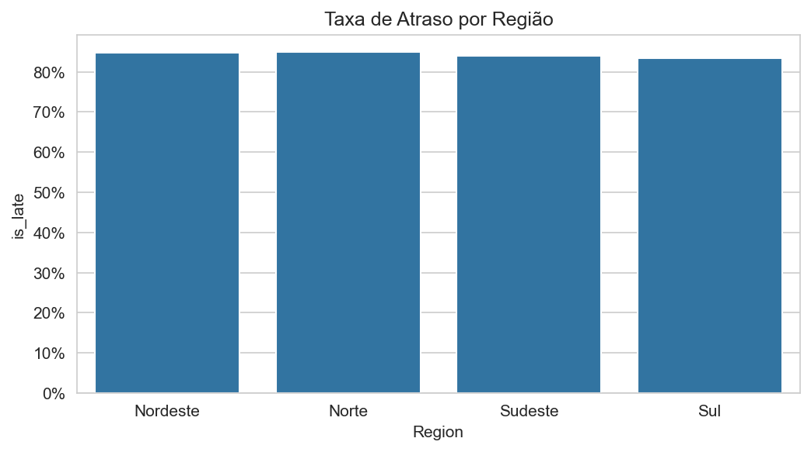
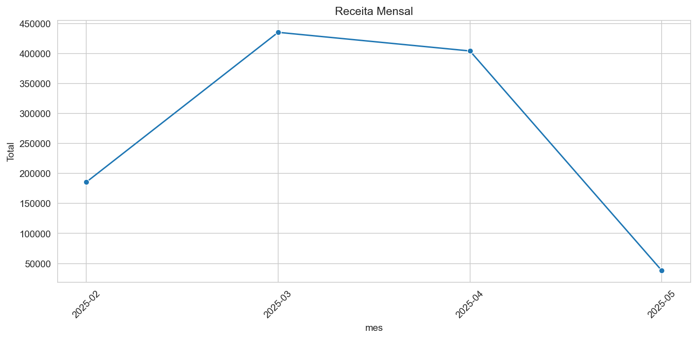
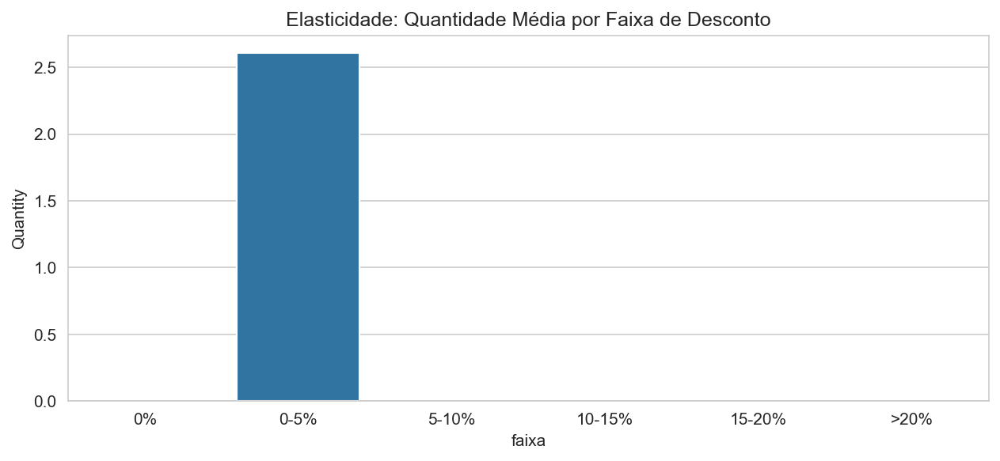

# E-commerce Data Insights  
Análise Exploratória, Estatística e Dashboard Interativo

Este projeto realiza uma análise completa dos dados de um e-commerce brasileiro, seguindo uma pipeline profissional de dados: **ETL → construção da ABT (Analysis Base Table) → EDA → Inferência Estatística → KPIs → Dashboard Streamlit**.

[](https://youtu.be/5m_tf7SgfRw)

---

# Sumário
1. [Objetivo Geral](#objetivo-geral)  
2. [Estrutura do Projeto](#estrutura-do-projeto)  
3. [Instalação e Execução](#instalação-e-execução)  
4. [Pipeline de Dados Utilizada](#pipeline-de-dados-utilizada)  
5. [Análises Realizadas](#análises-realizadas)  
6. [KPIs Principais](#kpis-principais)  
7. [Resultados e Gráficos](#resultados-e-gráficos)  
8. [Dashboard Streamlit](#dashboard-streamlit)  
9. [Conclusão](#conclusão)

---

# Objetivo Geral

O objetivo é fornecer ao time de direção de um e-commerce **uma visão analítica confiável**, estruturada em dados limpos, unidos e processados, permitindo interpretar:

- Receita e comportamento de vendas  
- Ticket médio e padrão de pedidos  
- Tempo e qualidade de entrega  
- Taxa de atraso  
- Elasticidade por categoria  
- Impacto de desconto  
- Sazonalidade da receita  
- Diferencial por serviço logístico  

---

# Estrutura do Projeto

```

ecommerce-data-insights/
│
├── ecommerce_data/                # Dados brutos DIM e FACT
├── images/                        # Gráficos gerados automaticamente
│   ├── atraso_por_regiao.png
│   ├── atraso_por_service.png
│   ├── box_ticket.png
│   ├── elasticidade.png
│   ├── hist_discount.png
│   ├── hist_prazo_entrega.png
│   ├── hist_ticket.png
│   └── receita_mensal.png
│
├── output/
│   └── (exportações opcionais)
│
├── abt.py                         # Construção da ABT (base final)
├── eda.py                         # Geração dos gráficos e estatísticas
├── metrics.py                     # KPIs e Intervalos de Confiança
├── app.py                         # Dashboard Streamlit
├── requirements.txt
└── README.md (este arquivo)

````

---

# Instalação e Execução

### 1. Criar ambiente virtual
```bash
python3 -m venv .venv
source .venv/bin/activate
````

### 2. Instalar dependências

```bash
pip install -r requirements.txt
```

### 3. Construir a ABT (Analysis Base Table)

```bash
python abt.py
```

### 4. Gerar EDA e gráficos automaticamente

```bash
python eda.py
```

### 5. Executar o dashboard Streamlit

```bash
streamlit run app.py
```

O dashboard abrirá em:

```
http://localhost:8501
```

---

# 🔄 Pipeline de Dados Utilizada

A metodologia segue um fluxo profissional:

## **1. ETL — Extração, Transformação e Carregamento**

✔ Leitura dos arquivos DIM e FACT
✔ Padronização de nomes
✔ Conversão de datas
✔ Tratamento de strings e tipos
✔ Junção das tabelas (modelo estrela)

## **2. Criação da ABT**

A ABT é a base analítica final contendo:

* Metadados de pedido
* Categorias e subcategorias
* Pagamento
* Dados de logística
* Variáveis derivadas:

  * `delivery_lead_time`
  * `delivery_delay_days`
  * `is_late`
  * `is_confirmed`
  * `is_canceled`
  * `freight_share`
  * `discount_abs`

## **3. EDA (Exploratory Data Analysis)**

✔ Histogramas
✔ Boxplots
✔ Séries temporais
✔ Análises por categoria
✔ Atraso por serviço e região

## **4. Inferência Estatística**

Foram calculados intervalos de confiança 95% para:

* Ticket Médio
* Prazo de Entrega
* Taxa de Atraso
* Taxa de Cancelamento

---

# Análises Realizadas

As principais análises incluem:

### • Distribuição do ticket

### • Comportamento do desconto

### • Prazos e atrasos de entrega

### • Elasticidade por categoria

### • Receita mensal

### • Atrasos por região e por tipo de serviço

---

# KPIs Principais obtidos

| KPI                        | Valor           |
| -------------------------- | --------------- |
| **Ticket Médio**           | R$ 2.645,42     |
| **Receita Total**          | R$ 1.063.460,74 |
| **Desconto Médio (%)**     | 0,0%            |
| **Take-Rate de Frete**     | 7,8%            |
| **Prazo Médio de Entrega** | 38,5 dias       |
| **Taxa de Atraso**         | 83,1%           |

---

# Resultados e Gráficos

A seguir estão os principais gráficos gerados automaticamente:

---

## **Distribuição do Ticket**



---

## **Boxplot do Ticket**



---

## **Distribuição dos Descontos**



---

## **Prazo de entrega**


---

## **Atraso por Serviço**



---

## **Atraso por Região**



---

## **Receita Mensal**



---

## **Elasticidade**



---

# Dashboard Streamlit

O aplicativo apresenta:

* Indicadores principais
* Abas de visualização: Ticket, Descontos, Entrega, Sazonalidade, Atrasos, Elasticidade
* Análises interativas
* Intervalos de Confiança
* Seção opcional de Dados Brutos

Execute com:

```bash
streamlit run app.py
```

---

# Conclusão

O projeto demonstra como **dados brutos podem ser processados, analisados e visualizados** com técnicas Ciência de Dados.

Este relatório atende integralmente os itens solicitados no projeto acadêmico:
→ ETL
→ EDA
→ Inferência
→ KPIs
→ Reprodutibilidade
→ Dashboard Interativo

---

# Autores
Projeto desenvolvido por DIEGO DAVID ALVES XAVIER, HYNGRID SOUZA E SILVA, PAMELA TEIXEIRA RODRIGUES, no contexto da disciplina de Estatística Aplicada — CESAR School.
